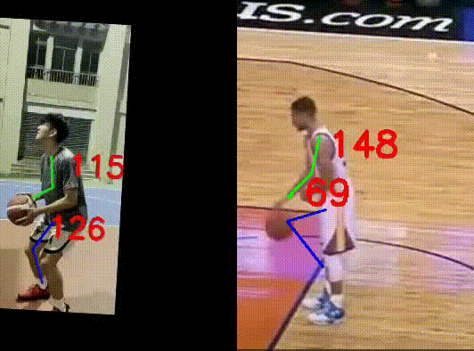

# 🏀Basketball Shot Analyzer🏀

This project is designed to analyze basketball shot posture using a combination of frontend and backend components. The system provides detailed feedback on shooting techniques to help players improve their performance.

## 📋 Project Overview
The project includes two main features: comparison analysis and independent analysis.

### Comparison Analysis
This feature takes two shooting videos as input: one of the user's shooting posture and another of their role model's (e.g., an NBA player). The output will be a side-by-side video that is temporally and spatially aligned, along with key frame images to help users easily compare their poses. Additionally, text feedback and training suggestions will be provided by a large language model.

### Independent Analysis
This feature takes a single input video of the user's shooting practice, which should include multiple shots. The goal is to identify weaknesses in the user's shooting technique and provide constructive feedback and a training plan to improve their shooting accuracy. Additionally, a path video will be generated to show the user their shooting trajectory.

## Prerequisites

- Node.js
- Python 3.9
- pip

##  🚀Getting Started
1. Clone the repository
    ```sh
    git clone https://github.com/chonyy/AI-basketball-analysis.git
    ```
2. Frontend Setup
   ```sh
   # navigate to the frontend direcotry
   cd frontend
   # install the dependencies
   npm install 
   # start the frontend server
   npm run dev
   ```
3. Backend Setup
    ```sh
    # navigate to the backend direcotry
    cd backend
    # create the virtual environment and activate the environment
    conda create --name your_env_name python=3.9
    conda activate your_env_name
    #install the dependencies
    pip install -r requirements.txt
    #update llm api keys in .env
    cp .env.example .env
    # start the backend server
    python app.py
   ```
4. Go to http://localhost:5173/ to upload your shooting videos and get the feedback.

## Features

### Frontend
- **NBA Team Colors Themes**: Multiple themes based on NBA team colors are available.
- **Theme Customization**: Users can change the theme to their preferred NBA team colors directly on the web.
- **Save Output**: Users can save the output text and images for future reference.
- **Custom LLM Integration**: Users can integrate different large language models (LLMs) if they have the necessary API keys.

### Backend
- **Video Upload**: Upload videos of basketball shots for analysis.
- **Shot Analysis**: Analyze individual and comparison shots to provide feedback.
- **Key Frames Extraction**: Extract key frames from the video to highlight important moments.
- **Feedback Generation**: Generate detailed feedback and suggestions for improvement.

## Results
### Comparison Analysis

### Independent Analysis